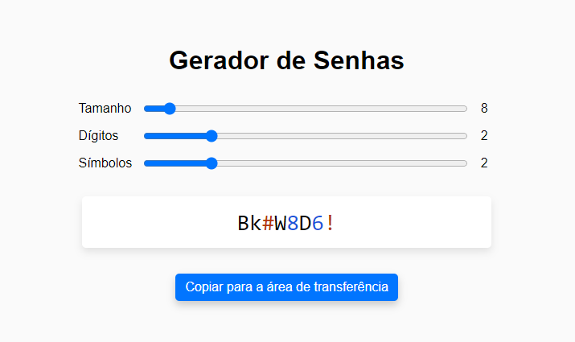

# Gerador de Senhas 2.0

#### Quarto projeto do curso de React Direto ao Ponto

## 🎯 Objetivo

Este é um projeto de um gerador de senhas, nele é possível escolher o tamanho da senha e quantidade de dígitos e símbolos. Além de, copiar para a área de transferência.

## 🚀 Como executar o projeto

1. Clone este repositório

`$ git clone https://github.com/giovanaraphaelli/password-generator.git`

2. Acesse a pasta do projeto no seu terminal/cmd

`$ cd password-generator`

3. Abra a pasta do projeto no VS Code via terminal/cmd

`$ code .`

4. Instale as dependências

`$ yarn install`

5. Execute a aplicação em modo de desenvolvimento

`$ yarn start`

6. A aplicação será aberta na porta: 3000 - acesse http://localhost:3000
